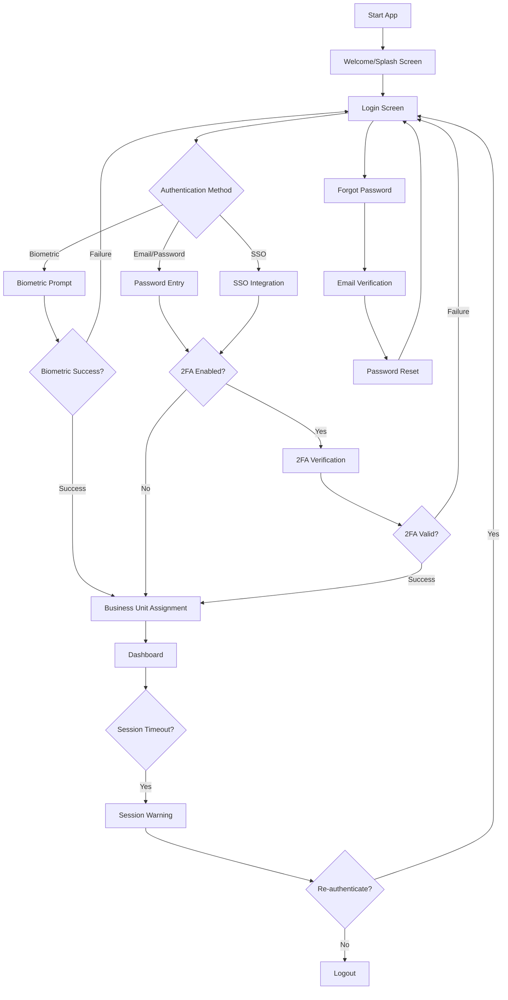
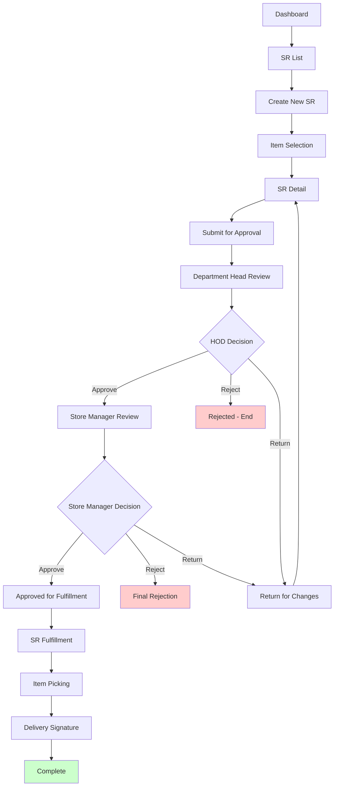
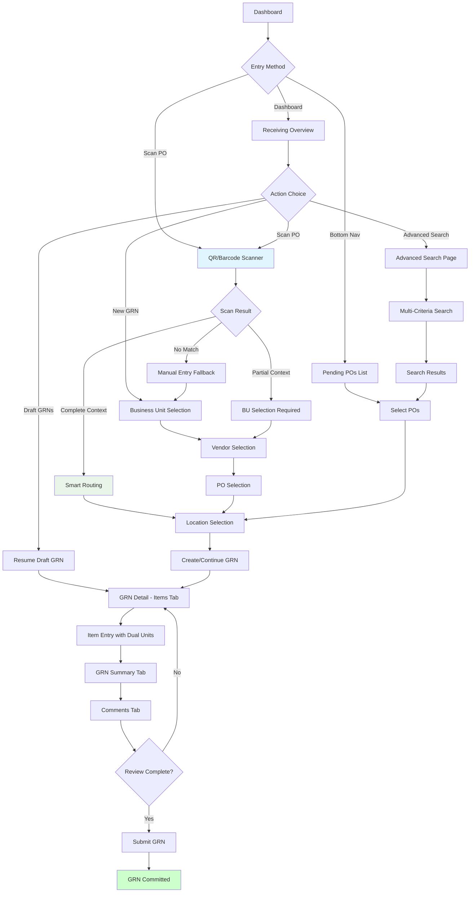
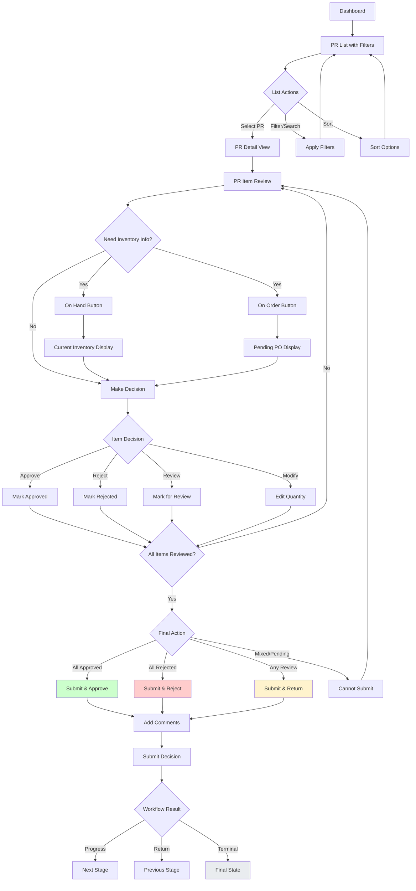
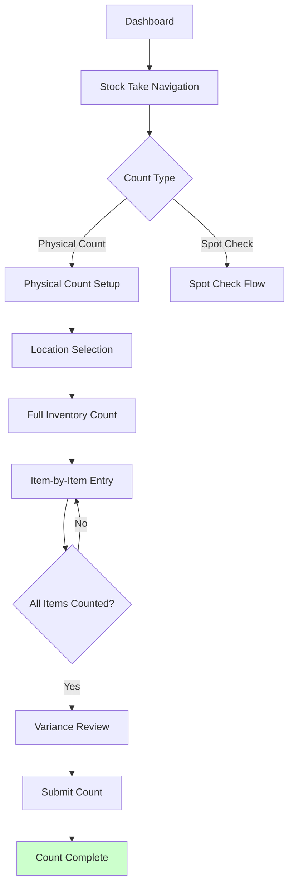
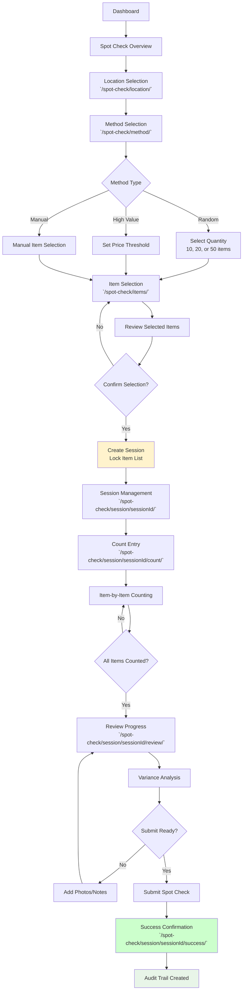
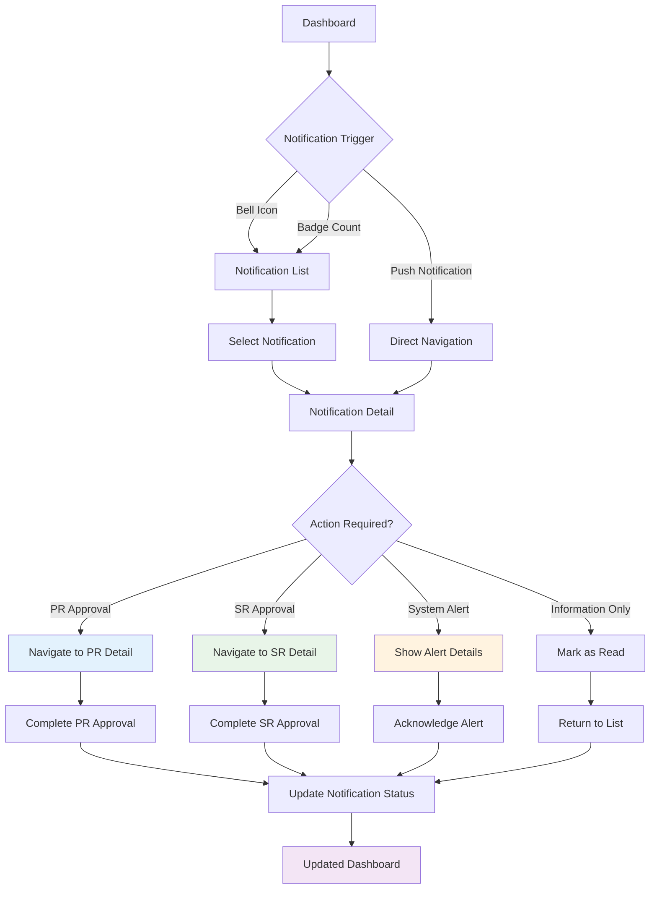
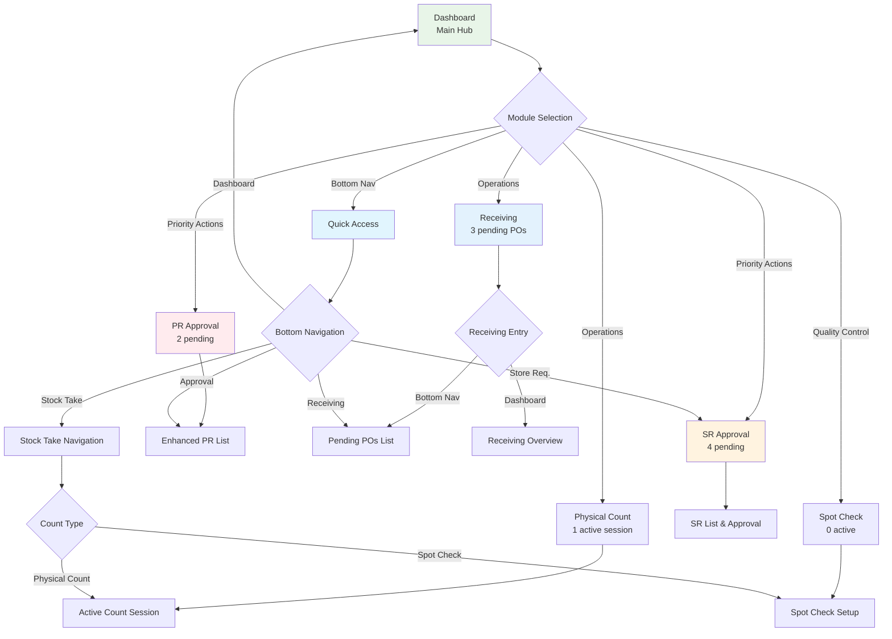

# Carmen Supply Chain Mobile App
# Comprehensive Product Requirements Document (PRD)

## Document Information
- Version: 2.2
- Date: January 2025 (Updated with PR Approval page enhancements, workflow status clarifications, and current app state)
- Product: Carmen Software Supply Chain Mobile App
- Target Industry: Hotels and Hospitality
- Document Type: Product Requirements Document (PRD)

## Table of Contents
1. Executive Summary
2. Product Vision & Strategy
3. Target Users & Personas
4. User Journey & Flow Analysis
5. Functional Requirements by Module
6. Technical Architecture & Integration
7. UI/UX Design Requirements
   - 7.5 Screen Inventory and Process Flows
8. Business Rules & Workflows
9. Success Metrics & KPIs
10. Implementation Roadmap
11. Risk Assessment & Mitigation
12. Acceptance Criteria
13. Current App State and Environment

---

## 1. Executive Summary

### 1.1 Product Overview
The Carmen Software Supply Chain Mobile App is a mobile-first supply chain management solution designed specifically for hotels and hospitality businesses. It streamlines inventory, purchasing, and approval workflows that traditionally required desktop systems or manual processes.

### 1.2 Business Problem
Traditional hotel supply chain management involves:
- Manual paperwork that gets lost
- Desktop-only systems not accessible on the operational floor
- Approval bottlenecks via email chains
- Incomplete audit trails
- Inventory discrepancies discovered too late
- Non-compliant inventory events
- Rework due to manual entry errors

### 1.3 Product Solution
A mobile-first tool that brings real-time, compliant, auditable supply chain management directly to where work happens - in restaurants, kitchens, storerooms, and receiving docks.

### 1.4 Key Value Propositions
- **90% increase** in supply chain transaction accuracy
- **75% reduction** in non-compliant inventory events
- **80% user adoption** of mobile workflows within 6 months
- **30% decrease** in monthly inventory reconciliation time
- Complete audit trail for all transactions
- Real-time inventory visibility and control

### 1.5 Recent Enhancements (January 2025)

#### PR Approval Page Interface Modernization
- **Advanced Search Filter Integration**: Moved Filters button to same row as search bar and converted to icon-only display with notification dot for active filters count
- **Default Content Filtering**: Set default view to show only "In-progress" PRs for improved workflow focus
- **Simplified Filter Dialog**: Removed Date Range, Workflow Stage, and Status filter sections for streamlined user experience
- **Clean PR Card Layout**: Removed document status and stage badges from PR cards for cleaner visual presentation
- **Business Unit Display Optimization**: Moved Business Unit from bottom to same row as PR number, removed "assigned unit" text, and increased text size from 12px to 14px for better readability
- **Business Unit Selector Relocation**: Moved Business Unit selector from filter dialog to top of page above search bar for better accessibility
- **Sorting Interface Overhaul**: Replaced filter icon button with sorting dropdown containing Date Newest/Oldest, Status, and Business Unit options
- **UI Label Cleanup**: Removed "Business Unit" label from BU selector for cleaner interface design

#### Workflow Status and Business Logic Clarifications
- **Document vs Item Status Distinction**: 
  - **Document Status** (PR level): Draft, In-progress, Returned, Completed, Rejected, Cancelled
  - **Item Status** (individual items within PRs): Pending, Approved, Review, Rejected
- **Business Unit Standardization**: Grand Hotel Singapore, Business Hotel Jakarta, Boutique Hotel Bangkok
- **Workflow Stage Definitions**: Draft (0), HOD Review (1), Finance Review (2), Vendor Allocation (3), Approved (4), Rejected (-1), Cancelled (-3)

#### Current App State and Navigation
- **App Running Environment**: Development server on port 3002 (port 3000 in use)
- **Active Module Focus**: PR approval page improvements and workflow optimization
- **Navigation Flow**: Bottom navigation provides direct access to most-used functionality
- **Context-Aware Routing**: Smart routing based on available context eliminates unnecessary workflow steps

---

## 2. Product Vision & Strategy

### 2.1 Vision Statement
To empower hospitality supply chain professionals with mobile-first tools that eliminate errors, enforce compliance, and provide complete visibility into every inventory transaction.

### 2.2 Mission Statement
Streamline hotel supply chain and financial workflows through accurate, fast, and compliant mobile inventory management, dramatically reducing errors while enforcing policy compliance.

### 2.3 Strategic Goals

#### Business Goals
- Increase supply chain transaction accuracy by 90% across all hotels in first year
- Reduce non-compliant inventory events by 75%
- Improve user adoption of mobile workflows to >80% of targeted staff within six months
- Enable near real-time analytics on supply chain and finance KPIs
- Demonstrate measurable audit trail completeness for all inventory transactions

#### User Goals
- Eliminate rework due to manual entry or incomplete records
- Accelerate receiving, approval, and audit tasks without leaving operational roles
- Enable cost controllers to execute efficient, policy-compliant spot checks anywhere
- Ensure correct tax and discount capture automatically
- Maintain continuity and accuracy across mobile sessions, even when interrupted

#### Non-Goals
- Full mobile inventory management (add/remove master items, deep edits)
- Advanced analytics or reporting beyond compliance views
- Desktop-only features or casual inventory browsing without workflow context

---

## 3. Target Users & Personas

### 3.1 Primary Personas

#### Persona 1: Cost Controller (Michelle)
**Demographics:**
- Role: Cost Controller/Finance Manager
- Experience: 5-10 years in hospitality finance
- Tech Comfort: Moderate to high
- Location: Multiple hotel properties

**Goals:**
- Ensure inventory accuracy through systematic audits
- Maintain compliance with financial policies
- Execute efficient spot checks anywhere on property
- Generate accurate audit trails for external reviews

**Pain Points:**
- Manual spot check processes are time-consuming
- Lost paperwork and incomplete records
- Difficulty accessing inventory data while on property floors
- Inconsistent audit trail documentation

**User Journey:**
1. Opens app → Dashboard shows all assigned hotel properties
2. Selects "Spot Check" → Chooses location (restaurant)
3. Picks check method: Random (20 items) or Manual selection
4. App generates locked item list for compliance
5. Goes through each item: counts, photos, notes
6. Uses [On Hand] and [On Order] buttons to verify expected quantities
7. Submits completed check → Creates audit trail

**Success Criteria:**
- Complete spot checks 90% faster than manual processes
- Zero incomplete audit sessions
- 100% compliance with financial policy requirements

#### Persona 2: Receiving Clerk (David)
**Demographics:**
- Role: Receiving/Warehouse Staff
- Experience: 2-5 years in hospitality operations
- Tech Comfort: Basic to moderate
- Location: Receiving dock, storage areas

**Goals:**
- Efficiently receive deliveries and update inventory
- Accurate quantity recording with proper unit conversions
- Document damaged or disputed items with photo evidence
- Complete receiving process without errors

**Pain Points:**
- Manual calculations prone to errors
- Missing receipts and documentation
- Unit conversion confusion (cases vs. bottles)
- Incomplete receiving records

**User Journey:**
1. Dashboard → "Purchase Orders" → Sees today's deliveries
2. Selects PO(s) → Creates Goods Receipt Note (GRN)
3. For each item: enters received quantity, handles unit conversions
4. Captures photos of damaged goods
5. Submits GRN → Inventory automatically updated

**Success Criteria:**
- 95% reduction in receiving errors
- 100% documentation of all deliveries
- Complete audit trail for all received items

#### Persona 3: PR Approver (Sarah - Department Head/Manager)
**Demographics:**
- Role: Department Head/Manager
- Experience: 5-15 years in hospitality management
- Tech Comfort: Moderate to high
- Location: Office and operational areas

**Goals:**
- Review and approve purchase requests efficiently
- Make informed decisions with current inventory data
- Maintain approval workflow compliance
- Prevent over-ordering and stockouts

**Pain Points:**
- Email approval chains are slow and unreliable
- Lack of current inventory information when approving
- Missing context about requestor needs
- Difficulty tracking approval status

**User Journey:**
1. Gets notification of pending PR → Taps to open directly
2. Reviews request details, sees requester and business justification
3. For each item: checks [On Hand] (current inventory) and [On Order] (incoming stock)
4. Approves, Rejects, Return or modifies quantities
5. Adds comments if needed → Submits decision

**Success Criteria:**
- 80% faster approval process
- 90% reduction in over-ordering
- 100% informed decision-making with inventory data

#### Persona 4: Store Staff (Maria - Store Requisition)
**Demographics:**
- Role: Department Staff/Store Assistant
- Experience: 1-3 years in hospitality
- Tech Comfort: Basic
- Location: Various departments (kitchen, housekeeping, F&B)

**Goals:**
- Request items from other departments/locations efficiently
- Track requisition status throughout approval process
- Receive requested items with proper documentation
- Maintain inventory levels for department operations

**Pain Points:**
- Manual requisition forms get lost
- No visibility into approval status
- Delays in receiving requested items
- Lack of proper documentation for internal transfers

**User Journey:**
1. Creates Store Requisition → Selects requesting department and source location
2. Adds items via search or barcode scan
3. Submits for approval → Department Head approves → Store Manager approves
4. Store staff fulfill request → Delivery confirmed with signature

**Success Criteria:**
- 70% faster requisition process
- 100% visibility into approval status
- Complete documentation of internal transfers

### 3.2 Secondary Users

#### IT Administrator
- System configuration and user management
- Business Unit assignment and role management
- Integration monitoring and troubleshooting

#### Finance Manager
- Audit trail review and compliance monitoring
- Financial control enforcement
- Analytics and reporting oversight

#### General Manager
- Overall operational oversight
- Performance monitoring and intervention
- Strategic decision-making support

---

## 4. User Journey & Flow Analysis

### 4.1 Overall Application Flow

```
Authentication → Dashboard → Module Selection → Workflow Execution → Audit Trail
```

### 4.2 Core Navigation Architecture

```
Dashboard (Home)
├── Store Requisition
│   ├── Create SR → Submit → Approvals → Issue
├── Receiving (Purchase Orders)
│   ├── Pending POs (Default via Bottom Navigation) → Enhanced Filtering → Create GRN
│   ├── Scan PO → Context Detection → Smart Routing → Location Selection → GRN Detail
│   ├── Traditional New GRN → BU Selection → Vendor Selection → PO Selection → Location → GRN Detail
├── PR Approval  
│   ├── Enhanced PR List (BU Selector + Search + Sort) → PR Detail → Item Review → Submit Decision
│   ├── Default "In-progress" Filter → Streamlined Interface → Priority-Based Workflow
├── Stock Take
│   ├── Physical Count OR Spot Check → Location → Count Items → Submit
└── Profile & Settings
```

#### 4.2.1 Enhanced Navigation Patterns
**Bottom Navigation Optimization:**
- **Receiving Tab**: Routes directly to Pending POs (`/receiving/pending-pos`) for immediate access to actionable items
- **Context-Aware Routing**: Smart detection and routing based on available context (BU, scan results)
- **Streamlined Workflows**: Reduced navigation steps through intelligent context preservation

**PR Approval Navigation Enhancements:**
- **Business Unit Selector**: Positioned prominently at top of page for workflow context
- **Default Filtering**: "In-progress" PRs shown by default for focused task management
- **Inline Search and Sort**: Combined search bar with sorting dropdown for efficient list management
- **Clean Interface Design**: Removed redundant UI labels and status badges for improved visual clarity

### 4.3 Critical User Journeys

#### Journey 1: Complete Spot Check Process
**Trigger:** Cost controller needs to verify inventory accuracy
**Steps:**
1. **Entry:** User opens app, sees dashboard with assigned properties
2. **Selection:** Taps "Spot Check" card
3. **Configuration:** Selects location, chooses method (Random/Manual), sets quantity
4. **Execution:** System generates locked item list, user counts each item
5. **Verification:** User can check [On Hand] and [On Order] for context
6. **Documentation:** Adds photos/notes for variances
7. **Completion:** Reviews summary, submits for audit trail
8. **Outcome:** Complete compliance record created

**Success Metrics:**
- 100% completion rate for initiated spot checks
- Zero lost or incomplete sessions
- Average time reduction of 60% vs. manual process

#### Journey 2: Purchase Order Receiving
**Trigger:** Delivery arrives at hotel receiving dock
**Steps:**
1. **Preparation:** User sees "Today's Deliveries" on dashboard
2. **Initiation:** Selects relevant PO(s) from list
3. **Processing:** Creates GRN, enters received quantities per item
4. **Conversion:** Handles unit conversions (cases to bottles) automatically
5. **Documentation:** Captures photos of damaged items, adds notes
6. **Verification:** Reviews totals, tax/discount calculations (read-only)
7. **Confirmation:** Captures delivery signature
8. **Completion:** Submits GRN, inventory automatically updates
9. **Outcome:** Complete receiving record with audit trail

**Success Metrics:**
- 95% accuracy in quantity recording
- 100% documentation of deliveries
- 80% reduction in receiving time

#### Journey 3: Purchase Requisition Approval
**Trigger:** PR notification received
**Steps:**
1. **Notification:** User receives PR approval notification
2. **Access:** Taps notification, directly opens PR detail
3. **Review:** Reviews requester, department, items, quantities
4. **Analysis:** For each item, checks [On Hand] and [On Order] status
5. **Decision:** Approves, rejects, or modifies quantities
6. **Documentation:** Adds approval comments
7. **Submission:** Submits decision
8. **Outcome:** PR advances in workflow with complete audit trail

**Success Metrics:**
- Average approval time under 15 minutes
- 90% first-time approval rate
- 100% informed decisions with inventory data

---

## 5. Functional Requirements by Module

### 5.1 Authentication & Session Management

#### 5.1.1 Core Authentication Features
**Login Methods:**
- Email/password authentication
- Single Sign-On (SSO) integration
- Token-based authentication (configurable)

**Session Management:**
- Automatic session timeout with re-authentication
- Secure token management
- Multi-device session handling

**Business Unit Authorization:**
- Multi-tenant architecture support
- User assignment to one or more Business Units (hotels)
- Automatic BU context application
- No BU selection required during workflows

#### 5.1.2 Security Requirements
- Failed login attempt tracking and account lockout
- All authentication events logged for audit
- Encrypted credential storage
- Session expiry notifications

### 5.2 Dashboard Module

#### 5.2.1 Core Dashboard Features
**Layout:**
- Mobile-optimized card-based design
- Role-based module visibility
- Real-time status counts for each module
- Quick access to notifications

**Components:**
- Module cards with clear, consistent naming:
  - "Receiving" for receiving workflows
  - "PR Approval" for purchase request approvals
  - "SR Approval" for store requisition approvals (updated from "Store Requisition" for better clarity and consistency)
  - "Physical Count" for inventory counting
  - "Spot Check" for audit processes
- Notification bell with unread count
- Business Unit selector/dropdown
- Theme toggle (light/dark mode)
- Profile access icon

#### 5.2.2 Business Logic
- Only authorized modules shown as cards
- Real-time or cached status counts
- Business Unit context preservation
- Navigation optimization for mobile

### 5.3 Store Requisition (SR) Module

#### 5.3.1 SR Creation and Management
**SR Creation Features:**
- Auto-generated SR numbers
- Header information capture:
  - Request date (defaults to current)
  - Requesting department selection
  - Source location selection
  - Business Unit display (non-interactive)
  - Optional notes/comments

**Item Management:**
- Search-based item selection
- Barcode scanning capability
- Item details capture:
  - Requested quantity and unit
  - Purpose (Regular, Special Event, Emergency)
  - Item-specific notes
  - **Enhanced Business Dimensions** with comprehensive structure:
    - Project Code (e.g., "PR-2025-001")
    - Market Segment (e.g., "Food & Beverage", "Executive Lounge")
    - Event (e.g., "Corporate Retreat", "Annual Gala Dinner")
  - **Price and cost totals** displayed on item cards for better financial visibility

**UI/UX Enhancements:**
- **Improved labeling**: "Store Name" (replacing "From") and "Request from" (replacing "To") for clearer inventory movement visualization
- **Well-spaced action buttons**: On Hand, On Order, and Detail buttons with Detail button properly aligned using ml-auto
- **Small-sized input controls**: Approved quantity and unit selector fields use small (sm) size with reduced padding and font size
- **Business Dimensions tags**: Displayed as color-coded badges (Project Code, Market Segment, Event) for quick visual identification

#### 5.3.2 SR Workflow and States
**State Flow:**
1. **Draft** → User creating/editing SR
2. **Submitted** → Awaiting Department Head approval
3. **HOD Approved** → Awaiting Store Manager approval
4. **Approved** → Ready for fulfillment
5. **Partially Fulfilled** → Some items issued
6. **Fulfilled** → All items issued and delivered
7. **Rejected** → Rejected by approver with reason
8. **Returned** → Returned for changes with comments

**Enhanced Approval Process:**
- Two-tier approval (Department Head → Store Manager)
- **Streamlined approval modal** focused on approval notes and comments without quantity adjustment controls
- Notification system for approvers
- Comments required for rejections
- **Approval workflow emphasizes notes and reasoning** rather than quantity modifications
- Audit trail for all actions

#### 5.3.3 SR Fulfillment
**Issuance Features:**
- Actual vs. requested quantity tracking
- Variance explanation requirements
- Shortage documentation
- Delivery confirmation with signature
- Timestamp and location recording

### 5.4 Receiving Module (PO & GRN)

#### 5.4.1 Enhanced Entry Points and Navigation

**Primary Navigation Access:**
- **Bottom Navigation**: "Receiving" tab routes directly to Pending POs list (`/receiving/pending-pos`) for immediate access to actionable items
- **Dashboard Access**: "Receiving" from dashboard routes to receiving overview (`/receiving`) with comprehensive module options
- **Optimized User Flow**: Most receiving work starts with pending deliveries, so bottom navigation provides the most efficient access path

**Scan PO (Primary Workflow):**
- **Smart QR/Barcode Scanning**: Camera-based scanning with instant PO recognition and validation
- **Updated Scan Text**: "Scan to add PO to the Good Receive Note" for clearer user guidance
- **Context-Aware Routing**: Automatic detection of Business Unit information in PO data for intelligent workflow routing
- **Streamlined Flow**: Direct navigation to location selection when complete context is available (PO + BU + Vendor)
- **Progressive Enhancement**: Three-tier approach based on available context (complete → partial → manual)
- **Fallback Options**: Manual entry and traditional flow for edge cases and scan failures
- **Visual Feedback**: Color-coded indicators for scan results (green=complete context, yellow=partial context, red=failed/not found)

**Enhanced Pending POs List (Primary Entry Point):**
- **Direct Access**: Bottom navigation routes immediately to pending purchase orders awaiting delivery
- **Advanced Filtering System**:
  - **Business Unit Selection**: Required for creating new GRNs, enables context-aware workflows
  - **Delivery Date Filtering**: Comprehensive date range picker with calendar integration
    - Predefined filter options (Today, Tomorrow, This Week, Next Week, Overdue)
    - Custom date range selection with progressive date picking
    - Smart display text showing current filter state
    - Professional calendar integration using shadcn UI components
  - **Search Functionality**: Multi-criteria search (PO number, vendor, description) with scan icon integration
- **New GRN Button Enhancement**:
  - **Context-Aware Behavior**: Disabled until specific Business Unit selected (not "All")
  - **Business Unit Selection Bypass**: When BU selected, New GRN routes directly to vendor selection (`/receiving/new`) bypassing BU selection page
  - **Streamlined Flow**: Eliminates redundant BU selection step by using filter context
- **Draft GRN Management**: Draft GRN banner relocated to page footer for better visibility and contextual access
- **Scan Integration**: Camera icon in search bar provides quick access to scan functionality

**Traditional PO Selection (Enhanced):**
- Business Unit selection followed by PO filtering and selection
- Multi-PO GRN creation capabilities
- **Currency grouping**: Purchase Orders grouped by currency with exchange rate display for multi-currency operations
- **Enhanced Search**: PO selection includes scan icon for barcode scanning during vendor-specific selection

#### 5.4.2 Streamlined Navigation Architecture

**Eliminated PO Detail View:**
- **Removed**: Separate PO detail view (`/receiving/[poId]`) eliminated to reduce navigation complexity
- **Consolidated Functionality**: Resume Draft GRN functionality moved to Pending POs list footer banner
- **Direct Action**: PO cards route directly to GRN creation workflow via location selection

**Business Unit Selection Optimization:**
- **Smart Bypass**: When specific BU selected in Pending POs, New GRN creation bypasses BU selection page entirely
- **Context Preservation**: Selected BU stored in sessionStorage and passed via URL parameters
- **Reduced Steps**: Traditional 6-step flow reduced to 5 steps when BU pre-selected
- **Implementation**: 
  ```
  // From Pending POs with BU selected:
  Pending POs → New GRN → Vendor Selection → PO Selection → Location Selection → GRN Detail
  
  // Traditional flow (when no BU context):
  Dashboard → New GRN → BU Selection → Vendor Selection → PO Selection → Location Selection → GRN Detail
  ```

#### 5.4.3 Smart PO Detection Logic

**Complete Context (PO with BU):**
- Instant validation and context extraction from scanned PO
- Direct routing to location selection bypassing BU selection
- 4-step streamlined workflow: Scan → Context Validation → Location Selection → GRN Creation
- **Performance**: ~30 seconds total time, 4 user interactions
- **Efficiency**: 80% faster than traditional flow

**Partial Context (PO without BU):**
- Guided flow through Business Unit selection with scanned PO context preserved
- Context preservation throughout workflow with URL parameter passing
- 6-step guided workflow: Scan → BU Selection → PO Confirmation → Location → GRN Detail → Complete
- **Performance**: ~60 seconds total time, 5+ user interactions
- **Efficiency**: 50% faster than manual entry

**No Match (PO Not Found):**
- Clear error messaging with actionable recovery options
- Multiple fallback paths: rescan, manual entry, traditional search
- Graceful degradation to traditional flow with preserved user intent
- **User Experience**: No dead ends, always provide next steps

#### 5.4.4 Location Selection Enhancement

**Context-Aware Location Selection:**
- Pre-populated delivery context (PO, BU, Vendor, Currency)
- Location filtering based on Business Unit and delivery type
- Smart location suggestions based on PO item categories
- **Location Types**: Main Receiving Dock, Kitchen Receiving, Bar Storage, Housekeeping Storage, Maintenance Workshop
- Direct navigation to GRN detail with complete context preservation

#### 5.4.5 Enhanced Purchase Order Management

**Enhanced Pending POs Features:**
- **Priority-Based Organization**: Today's deliveries prioritization with smart filtering and status indicators
- **Comprehensive Search**: Multi-criteria search capabilities (PO number, vendor, description) with integrated scan functionality
- **Business Unit Context**: Persistent business unit context throughout the receiving flow
- **Status and Priority Indicators**: 
  - Visual priority badges (Overdue, Due Today, Due Tomorrow, Due Soon, On Time)
  - Color-coded status indicators for delivery urgency
- **Batch Workflow Support**: Foundation for multi-PO GRN creation
- **Enhanced PO Cards**: Complete PO information with vendor, business unit, delivery dates, and financial details

**Draft GRN Integration:**
- **Footer Banner**: Draft GRNs displayed in prominent footer banner with full details
- **Resume Functionality**: Direct navigation to GRN detail for continuing incomplete work
- **Contextual Information**: Each draft shows linked PO numbers, creation date, item count, and vendor
- **Workflow Continuity**: Seamless transition between pending POs and draft GRNs

#### 5.4.6 Enhanced Goods Receipt Note (GRN) Management

**GRN Creation:**
- Direct creation from selected PO(s) with context preservation
- **Context Integration**: Seamless integration of scan-derived context (BU, vendor, location)
- Item-by-item receiving process with smart defaults
- Unit conversion support (PO units ↔ inventory units)

**GRN States and Workflow:**
1. **Draft** → Items can have zero quantities, fully editable
2. **Received** → All items have quantities > 0, still editable
3. **Committed** → Finalized, cannot be edited or voided
4. **Void** → Cancelled, items returned to PO

**Comprehensive GRN Processing Features:**
- **Streamlined multi-tab interface** for GRN details including:
  - **Items tab**: Item-level receiving with separate unit dropdowns for "Received Qty" and "FOC Qty" inputs, allowing flexible receiving scenarios where different units may be used
  - **Summary tab**: Overall GRN information with context display and financial summary
  - **Comments tab**: Chat-style comment interface with file attachments and photo capture capabilities
- **Enhanced unit selection**: Each quantity input (Received and FOC) has its own dedicated unit selector for maximum flexibility
- **Location-based item organization**: Items automatically grouped by their assigned store locations with clear visual separation and location headers showing item counts
- **Status-based actions**: Resume, Continue, View based on GRN state
- **Smart Defaults**: Pre-filled information based on scan context
- **Business Dimensions Removal**: Job Code, Event, and Market Segment fields removed from item display for streamlined interface
- Dual unit receiving (PO units or inventory units)
- Real-time conversion calculations
- Tax and discount display (read-only on mobile)
- Complete audit logging with scan timestamps

#### 5.4.7 Enhanced Business Rules and Navigation

- **Optimized Navigation Hierarchy**: Bottom navigation provides direct access to most-used functionality (Pending POs) while dashboard maintains comprehensive overview
- **Unified Workflow Consistency**: Both scan PO and traditional New GRN flows use identical location selection interfaces and navigation patterns for consistent user experience
- **Context-Aware Routing**: Smart routing based on available context eliminates unnecessary steps
- **Scan-First Integration**: Scan functionality integrated throughout receiving workflows via camera icons in search interfaces
- **Context Preservation**: All scan-derived context and filter selections maintained throughout workflow
- **Location-Based Item Filtering**: Items automatically filtered and grouped by their assigned store locations, ensuring users only see items relevant to their selected receiving locations
- **Standardized Parameter Handling**: Both flows use consistent URL format with multiple `po` parameters for unified data flow
- **Enhanced User Experience**: Reduced navigation complexity with intelligent workflow routing
- No "Add Item" functionality (maintains traceability to source documents)
- Tax/discount overrides only available on desktop
- All receiving actions fully audited with scan metadata

**Navigation Flow Optimization:**
```
Bottom Navigation Flow (Primary):
Bottom Nav "Receiving" → Pending POs List → [Filter by BU] → Create GRN → Vendor Selection → PO Selection → Location Selection → GRN Detail

Dashboard Flow (Comprehensive):
Dashboard → Receiving Overview → [Scan PO | New GRN | Manage GRN] → Context-based routing

Scan Flow (Fastest):
Any Page → Scan PO → Context Detection → Location Selection → GRN Detail
```

### 5.5 PR Approval Module

#### 5.5.1 Enhanced PR List Interface and Filtering
**Modernized List Features:**
- **Business Unit Selector**: Positioned at top of page above search bar for improved accessibility
- **Default Filtering**: Shows only "In-progress" PRs by default for focused workflow management
- **Advanced Search Integration**: Search bar with inline sorting dropdown replacing traditional filter button
- **Sorting Options**: Date Newest/Oldest, Status, and Business Unit sorting directly from dropdown
- **Clean Visual Design**: Removed UI labels (e.g., "Business Unit" label) for cleaner interface
- **Active Filter Indication**: Icon-only filter button with notification dot showing active filters count

**Enhanced PR Card Information:**
- **Streamlined Layout**: Business Unit moved to same row as PR number for better space utilization
- **Clean Visual Presentation**: Removed document status badges and stage information for cleaner cards
- **Improved Typography**: Business Unit text increased from 12px to 14px for better readability
- **Essential Information Focus**: PR number, requestor, department, total value, and submission date
- **Business Unit Integration**: Non-interactive Business Unit display in header row

#### 5.5.2 PR Review and Approval Workflow
**Enhanced Review Features:**
- Complete PR details display with streamlined interface
- Line-by-line item review with dual status tracking (Document vs Item level)
- Item-level decision actions with priority-based workflow logic
- **Document Status Context**: Draft, In-progress, Returned, Completed, Rejected, Cancelled
- **Item Status Management**: Pending, Approved, Review, Rejected for individual items
- Tax/discount information display (read-only on mobile)

**Advanced Decision Engine:**
- **Priority-Based Workflow Logic**:
  1. All items rejected → PR becomes "Rejected" (highest priority)
  2. Any item marked "Review" → PR returns to previous stage (high priority)
  3. Any item still "Pending" → Submission blocked (medium priority)
  4. Any item approved → PR progresses (low priority, only if no higher priorities)

**Dynamic Submit Actions:**
- Context-aware submit button behavior:
  - "Submit & Approve" (green) - when items approved and no reviews/rejections
  - "Submit & Reject" (red) - when all items rejected
  - "Submit & Return" (orange) - when any items marked for review
  - Disabled state when items still pending review

**Edit State Management:**
- **Save/Cancel Functionality**: Replaces submit button when any item is edited
- **Original State Preservation**: System maintains original values for accurate reversion
- **Controlled Components**: All input fields with proper state synchronization
- **Smart Edit Detection**: Triggers Save/Cancel mode when changes detected

#### 5.5.3 Inventory Information Access (PR Approval Only)
**On Hand Button:**
- Current inventory by location with min/max levels
- Last counted/stocked dates for inventory accuracy
- Mobile-optimized overlay with easy-to-scan data
- **Availability**: Exclusively in PR Approval module

**On Order Button:**
- Pending PO information with vendor and quantity details
- Status indicators and delivery due dates
- Quick-access mobile interface with easy close functionality
- **Restriction**: Never available in Receiving workflows

**Context-Aware Display:**
- Only appears in PR Approval workflows for informed decision-making
- Provides real-time inventory context for approval decisions
- Supports approval workflow with current stock visibility

### 5.6 Stock Take Module

#### 5.6.1 Stock Take Navigation
**Entry Options:**
- Physical Count selection
- Spot Check selection
- Location-based session creation

**Session Management:**
- Draft, In Progress, Review, Submitted, Approved states
- Save/resume functionality
- Progress tracking display

#### 5.6.2 Count Entry Process
**Item Counting:**
- Name-first display format
- System quantity display (if authorized)
- Actual count entry
- Automatic variance calculation
- Photo attachment for discrepancies

**Submission Requirements:**
- All items must be counted
- Variance review for flagged items
- Complete session before submission

### 5.7 Spot Check Module

#### 5.7.1 Spot Check Initiation
**Setup Options:**
- Location selection
- Item selection methods:
  - Random (10, 20, or 50 items)
  - High Value (with price filter)
  - Manual selection
- Session locking after initiation

#### 5.7.2 Spot Check Execution
**Count Process:**
- Locked item list (compliance requirement)
- Progress tracking display
- Item-by-item count entry
- Photo and note attachments
- Session persistence (pause/resume)

**Completion Requirements:**
- All items must be checked
- Submit only when complete
- Audit logging with timestamps and location

#### 5.7.3 Compliance Features
- Session start and completion timestamps
- Location recording for audit
- Locked item list cannot be modified
- Complete audit trail for all actions

### 5.8 Notification Module

#### 5.8.1 Notification Types
**Trigger Events:**
- PR requiring approval
- PR returned or rejected
- System alerts for critical issues

**Notification Display:**
- Bell icon on dashboard
- Unread count indicators
- Chronological listing
- Direct navigation links

#### 5.8.2 Notification Management
**User Actions:**
- Mark as read/unread
- Dismiss or archive
- Direct tap-to-navigate functionality

**Content Elements:**
- Context and summary information
- Business Unit reference
- Timestamp display
- Action requirements

### 5.9 Profile & Settings Module

#### 5.9.1 Profile Information
**User Details Display:**
- Personal information
- Role assignments
- Business Unit assignments (informational)
- System permissions

#### 5.9.2 Account Management
**Available Actions:**
- Password change (if applicable)
- Logout functionality
- App information access
- Privacy policy and terms access

**Security Features:**
- All profile actions audit-logged
- No Business Unit modification capability
- Secure credential management

---

## 6. Technical Architecture & Integration

### 6.1 Technical Stack Requirements

#### 6.1.1 Mobile Application
**Frontend Framework:**
- React Native or Native iOS/Android
- Material UI and ShadCN components
- Responsive design for various screen sizes
- Offline-first architecture

**State Management:**
- Redux or Context API for React
- Local storage with IndexedDB
- Optimistic UI updates
- Conflict resolution mechanisms

#### 6.1.2 Backend Architecture
**API Design:**
- RESTful APIs for all modules
- GraphQL endpoints where appropriate
- Real-time WebSocket connections for notifications
- Comprehensive error handling

**Database Requirements:**
- Multi-tenant data architecture
- Audit trail storage
- Business Unit data segregation
- Transaction consistency

### 6.2 Integration Points

#### 6.2.1 External System Integration
**PMS/ERP Integration:**
- Master item data synchronization
- Location and outlet data
- User and role management
- Business Unit configuration

**Vendor Management:**
- Real-time vendor lookups
- Purchase order mapping
- Pricing information
- Contract terms access

#### 6.2.2 Internal System Integration
**Authentication Services:**
- SAML/OAuth integration
- SSO provider connectivity
- Token management
- Session synchronization

**Analytics Platform:**
- Transaction data export
- Audit trail analytics
- Performance metrics
- Compliance reporting

### 6.3 Security Architecture

#### 6.3.1 Data Security
**Encryption Requirements:**
- Data in transit encryption (TLS 1.3)
- Data at rest encryption
- Credential encryption
- Audit log protection

**Access Control:**
- Role-based access control (RBAC)
- Business Unit authorization enforcement
- API endpoint security
- Session management

#### 6.3.2 Compliance Requirements
**Audit Trail:**
- Complete action logging
- User identification tracking
- Timestamp accuracy
- Data integrity verification

**Data Privacy:**
- GDPR compliance where applicable
- Data retention policies
- User consent management
- Privacy by design principles

### 6.4 Performance Requirements

#### 6.4.1 Response Time Targets
- Page load time: < 2 seconds
- API response time: < 500ms for standard operations
- Search results: < 1 second
- Offline sync: < 5 minutes when connection restored

#### 6.4.2 Scalability Targets
- Support 10,000+ daily active users
- Handle hundreds of concurrent sessions
- Process thousands of transactions per day
- Scale across multiple hotel properties

---

## 7. UI/UX Design Requirements

### 7.1 Design Principles

#### 7.1.1 Mobile-First Design
**Core Principles:**
- Touch-optimized interfaces
- Single-handed operation support
- Large tap targets (minimum 44px)
- Thumb-reach optimization

**Visual Hierarchy:**
- Name-first display (Product Name before SKU)
- Clear status indicators
- Scannable card layouts
- Progressive disclosure

#### 7.1.2 Consistency Requirements
**Design System:**
- Carmen Software branding alignment
- Consistent color palette and typography
- Standardized component library
- Unified interaction patterns

**Content Patterns:**
- Business Unit always shown as non-interactive label
- Tax/discount always read-only on mobile
- Consistent error messaging
- Standardized form layouts

### 7.2 Key UI Components

#### 7.2.1 Navigation Components
**Tab Bar:**
- Bottom-positioned for easy access
- Icon + label combinations
- Active state indicators
- Badge notifications

**Cards and Lists:**
- Clean card layouts with proper spacing
- Status badges with color coding
- Action buttons with clear CTAs
- Swipe actions where appropriate

#### 7.2.2 Form Components
**Input Controls:**
- Mobile-optimized keyboards
- Clear field labeling
- Inline validation
- Error state handling
- Stepper controls (+/- buttons) for numerical inputs (e.g., quantities, amounts) to enhance mobile usability, alongside direct keyboard input.

**Selection Controls:**
- Dropdown selects for mobile
- Date pickers with native controls
- Search functionality in long lists
- Multi-select capabilities

#### 7.2.3 Information Display
**On Hand/On Order Overlays:**
- Modal presentation style
- Easy-to-scan data tables
- Quick close functionality
- Context-aware information

**Status and Progress:**
- Color-coded status badges
- Progress indicators for multi-step processes
- Loading states with skeleton screens
- Success/error confirmations

### 7.3 Accessibility Requirements

#### 7.3.1 WCAG Compliance
**Level AA Compliance:**
- Color contrast ratios meet standards
- Text scaling support
- Screen reader compatibility
- Keyboard navigation support

**Mobile Accessibility:**
- Voice control compatibility
- Gesture alternatives
- Dynamic type support
- Reduced motion options

### 7.4 Responsive Design

#### 7.4.1 Device Support
**Primary Targets:**
- Smartphones (iOS and Android)
- Portrait and landscape orientations
- Various screen sizes (5" to 7")
- Different pixel densities

**Secondary Targets:**
- Tablets for manager/supervisor use
- Foldable devices
- Accessibility device compatibility

### 7.5 Screen Inventory and Process Flows

#### 7.5.1 Complete Screen Inventory

**Authentication & Session Management (33 screens)**
1. **Welcome/Splash Screen** - App introduction and branding
2. **Login Screen** - Email/password or SSO authentication
3. **SSO Integration Screen** - Corporate SSO login flow
4. **Forgot Password Screen** - Email input for password reset
5. **Password Reset Screen** - New password entry after reset link
6. **Account Lockout Screen** - Failed login attempt handling with unlock options
7. **2FA Setup Screen** - Configure two-factor authentication
8. **2FA Verification Screen** - Enter verification code
9. **Biometric Setup Screen** - Configure fingerprint/face ID
10. **Biometric Authentication Screen** - Biometric login prompt
11. **Session Timeout Screen** - Re-authentication prompt
12. **Session Expiry Warning Screen** - Warning before timeout
13. **Multi-Device Session Screen** - Manage active sessions across devices
14. **Device Authorization Screen** - Approve new device access
15. **Logout Confirmation Screen** - Confirm logout action
16. **Password Change Screen** - Change current password
17. **Account Verification Screen** - Email/phone verification
18. **Security Questions Setup** - Configure security questions
19. **Security Questions Screen** - Answer security questions for recovery
20. **Terms and Conditions Screen** - Legal terms acceptance
21. **Privacy Policy Screen** - Privacy policy review and acceptance
22. **Permissions Request Screen** - Camera, location, storage permissions
23. **First-Time Setup Screen** - Initial app configuration
24. **Account Recovery Screen** - Account recovery options
25. **Invalid Token Screen** - Handle expired/invalid authentication tokens
26. **Network Error Screen** - Authentication network issues
27. **Maintenance Mode Screen** - System maintenance notifications
28. **Business Unit Assignment Screen** - Display assigned BUs (informational)
29. **Role Verification Screen** - Confirm user role assignments
30. **Compliance Acknowledgment Screen** - Accept audit trail and compliance terms
31. **Token Refresh Screen** - Background token renewal indicators
32. **Security Alert Screen** - Suspicious activity notifications
33. **Session History Screen** - View login history and active sessions

**Dashboard (1 screen)**
34. **Main Dashboard** - Module cards with status counts, notifications bell, BU display

**Store Requisition Module (6 screens)**
35. **SR List Screen** - View existing requisitions with status
36. **SR Creation Screen** - New requisition form with header info
37. **Item Selection Screen** - Search and add items to SR
38. **SR Detail Screen** - View/edit SR details and items
39. **SR Approval Screen** - Review and approve/reject SRs (for approvers)
40. **SR Fulfillment Screen** - Issue items and capture delivery signature

**Receiving Module (5 screens)**
41. **Purchase Order List Screen** - Today's deliveries and PO filtering
42. **PO Detail Screen** - View PO information and line items
43. **GRN Creation Screen** - Create GRN from selected PO(s) with location-based item organization
44. **GRN Item Entry Screen** - Enter received quantities with enhanced dual unit selection (separate units for Received Qty and FOC Qty)
45. **GRN Summary Screen** - Review totals, tax/discount (read-only), and comments with chat-style interface

**PR Approval Module (6 screens)**
48. **PR List Screen** - Pending approvals with filtering options
49. **PR Detail Screen** - Complete PR review with item details
50. **PR Item Review Screen** - Line-by-line approval with quantity modification
51. **On Hand Overlay** - Current inventory information modal
52. **On Order Overlay** - Pending PO information modal
53. **Approval Confirmation Screen** - Final approval/rejection with comments

**Stock Take Module (5 screens)**
54. **Stock Take Navigation Screen** - Choose Physical Count or Spot Check
55. **Location Selection Screen** - Choose counting location
56. **Physical Count Screen** - Full inventory count interface
57. **Count Entry Screen** - Individual item counting with variance display
58. **Count Review Screen** - Review and submit completed count

**Spot Check Module (5 screens)**
59. **Spot Check Setup Screen** - Configure check parameters
60. **Item Selection Method Screen** - Choose Random/High Value/Manual
61. **Spot Check Execution Screen** - Locked item list with progress
62. **Count Progress Screen** - Track completion status
63. **Variance Review Screen** - Review discrepancies before submission

**Notifications (2 screens)**
64. **Notification List Screen** - Chronological notification display
65. **Notification Detail Screen** - Individual notification content

**Profile & Settings (3 screens)**
66. **Profile Information Screen** - User details and role assignments
67. **Account Management Screen** - Password change, logout options
68. **Settings Screen** - App preferences and configuration

**Supporting/Overlay Screens (7 screens)**
69. **Search Results Screen** - Item search results across modules
70. **Barcode Scanner Screen** - Camera interface for scanning
71. **Photo Capture Screen** - Camera interface for documentation
72. **Error/Confirmation Screens** - Success/failure notifications
73. **Loading/Progress Screens** - Data loading and sync status
74. **Offline Status Screen** - Offline mode indicators and sync status
75. **Help/Tutorial Screens** - User guidance and feature explanations

#### 7.5.2 Process Flow Diagrams with Mermaid

**Authentication Process Flow**


**Alternative Authentication Flows:**
- **First Time User**: Welcome → Terms/Privacy → Account Setup → Role Verification → Dashboard
- **Password Recovery**: Login → Forgot Password → Email Verification → Password Reset → Login
- **Session Timeout**: Session Warning → Re-authentication → Continue Session OR Logout
- **Biometric Login**: Welcome → Biometric Prompt → Dashboard (if successful)

**Store Requisition Process Flow**


**Receiving Process Flow**


**PR Approval Process Flow**


**Stock Take Process Flow**


**Enhanced Spot Check Process Flow**


**Notification Process Flow**


**Dashboard Hub Navigation Flow**


#### 7.5.3 Cross-Module Navigation Patterns

**Universal Navigation Elements:**
- **Bottom Tab Bar**: Dashboard, Active Module, Notifications, Profile
- **Header Elements**: Business Unit Display (non-interactive), Search, Settings
- **Action Buttons**: Context-specific primary actions
- **Status Indicators**: Progress, connectivity, sync status

**Modal/Overlay Patterns:**
- **On Hand/On Order**: Only available in PR Approval module
- **Photo Capture**: Available across all modules requiring documentation
- **Barcode Scanner**: Available in item selection screens
- **Search Results**: Consistent across all modules

**State Persistence Rules:**
- **Draft States**: Automatically saved and resumable
- **Session Continuity**: Maintain context across app suspend/resume
- **Offline Sync**: Queue actions for sync when connection restored
- **Error Recovery**: Graceful handling of interruptions

#### 7.5.4 Screen-to-Screen Transition Rules

**Navigation Hierarchy:**
1. **Dashboard** (Home) - Central hub for all modules
2. **Module Lists** - Entry points for each functional area
3. **Detail Screens** - Specific item/transaction views
4. **Action Screens** - Task completion interfaces
5. **Confirmation Screens** - Final validation before submission

**Back Navigation Rules:**
- **Hardware Back Button**: Return to previous screen in logical hierarchy
- **Cancel Actions**: Return to entry point with unsaved changes warning
- **Complete Actions**: Navigate to success confirmation then return to list view
- **Error States**: Provide clear path back to working state

**Deep Linking Support:**
- **Notification Links**: Direct navigation to specific PR, SR, or GRN
- **Barcode Scans**: Direct item lookup with context preservation
- **Search Results**: Navigate to item detail with return context
- **Approval Actions**: Direct access to pending approvals

#### 7.5.5 Responsive Design Adaptations

**Phone (Primary)**
- Single column layouts
- Bottom sheet modals
- Thumb-optimized navigation
- Simplified information density

**Tablet (Secondary)**
- Two-column layouts where appropriate
- Larger modal dialogs
- Enhanced information display
- Side navigation panels

**Landscape Orientation**
- Horizontal layout optimization
- Split-screen capabilities for tablets
- Enhanced keyboard accessibility
- Optimized form layouts

#### 7.5.6 Accessibility Flow Considerations

**Screen Reader Navigation:**
- Logical heading hierarchy
- Clear landmark identification
- Descriptive button and link text
- Form field association

**Keyboard Navigation:**
- Tab order optimization
- Skip links for efficiency
- Keyboard shortcuts for common actions
- Focus management across screens

**Visual Accessibility:**
- High contrast mode support
- Text scaling accommodation
- Color-blind friendly indicators
- Reduced motion alternatives

---

## 8. Business Rules & Workflows

### 8.1 Multi-Tenant Business Rules

#### 8.1.1 Business Unit Management
**Core Rules:**
- Users assigned to one or more Business Units
- Business Unit context always visible but never selectable
- Data segregation enforced at all levels
- No cross-BU data access without authorization

**Authorization Matrix:**
- Role-based permissions within each BU
- Different roles possible across different BUs
- Permission inheritance rules
- Override capabilities for senior roles

#### 8.1.2 Terminology Standardization
**Business Dimensions Standardization:**
- **Terminology Standardization**: All references to "Transaction Analytics Dimensions" have been updated to "Business Dimensions" across all documentation and user interfaces for consistency
- Consistent naming conventions across all modules and documentation
- Standardized field labels and terminology throughout the application
- Clear, user-friendly language that aligns with hospitality industry standards

### 8.2 Workflow State Management

#### 8.2.1 Document Status and Workflow Stage Configuration

**Document Status Definitions (PR Level):**
- **Draft**: Document is being prepared by the requestor
- **In-progress**: Document is progressing through the approval workflow  
- **Returned**: Document returned to previous stage for modifications
- **Completed**: Document has been fully approved and finalized
- **Converted**: Document has been approved and converted to Purchase Order
- **Rejected**: Document has been rejected and workflow terminated
- **Cancelled**: Document has been cancelled and workflow terminated

**Document Status Implementation Details:**
- Document Status represents the STATE/CONDITION of the document
- Workflow Stage represents WHERE the document is in the approval process
- Valid status combinations are enforced through stage-to-status mapping
- Color coding and visual indicators are consistently applied across the interface
- Status transitions follow business rules with proper validation

**Item Status Definitions (Individual Items within PRs):**
- **Pending**: Item awaiting review or approval decision
- **Approved**: Item has been approved for procurement
- **Review**: Item marked for further review or returned to previous stage
- **Rejected**: Item has been rejected and will not be procured

**Workflow Stage Configuration:**
- **Stage 0 - Draft**: Initial document creation (Requestor role)
- **Stage 1 - HOD Review**: Head of Department review and approval
- **Stage 2 - Finance Review**: Finance department review and approval
- **Stage 3 - Vendor Allocation**: Purchasing department vendor assignment
- **Stage 4 - Approved**: Final approved state
- **Stage -1 - Rejected**: Terminal rejection state
- **Stage -3 - Cancelled**: Terminal cancellation state

**Stage-to-Status Mapping (Current Implementation):**
- **Stage 0 (Draft)**: Valid Statuses = ["Draft"]
- **Stage 1 (HOD Review)**: Valid Statuses = ["In-progress", "Returned"]
- **Stage 2 (Finance Review)**: Valid Statuses = ["In-progress", "Returned"]
- **Stage 3 (Vendor Allocation)**: Valid Statuses = ["In-progress", "Returned"]
- **Stage 4 (Approved)**: Valid Statuses = ["Completed", "Converted"]
- **Stage -1 (Rejected)**: Valid Statuses = ["Rejected"]
- **Stage -3 (Cancelled)**: Valid Statuses = ["Cancelled"]

**Status-to-Default-Stage Mapping:**
- "Draft" → Stage 0, "In-progress" → Stage 1, "Returned" → Stage 0
- "Completed" → Stage 4, "Converted" → Stage 4, "Rejected" → Stage -1, "Cancelled" → Stage -3

**Workflow Decision Engine:**
The system determines PR progression using priority-based logic:
1. **All Rejected Priority (Highest)**: If ALL items rejected → PR status becomes "Rejected"
2. **Any Review Priority (High)**: If ANY item marked for "Review" → PR returns to previous stage
3. **Any Pending Priority (Medium)**: If ANY item still "Pending" → Submission blocked until all reviewed
4. **Any Approved Priority (Low)**: If ANY item approved (and no higher priorities) → PR progresses to next stage

#### 8.2.2 Business Unit and Role Configuration

**Standardized Business Units:**
- Grand Hotel Singapore
- Business Hotel Jakarta  
- Boutique Hotel Bangkok

**Role-Based Permissions:**
- **Requestor**: Can view stages 0-4, edit stage 0, create PRs
- **HOD**: Can view stages 0-4, edit/approve stage 1
- **Finance**: Can view stages 0-4, edit/approve stage 2
- **Purchasing**: Can view stages 0-4, edit/approve stage 3

### 8.3 Data Validation Rules

#### 8.3.1 Quantity and Unit Validation
**Receiving Validation:**
- Received quantity cannot exceed PO quantity (with tolerance)
- Unit conversions must be accurate
- Partial units allowed/blocked per configuration
- Zero quantities keep GRN in Draft state

**Requisition Validation:**
- Requested quantities must be positive
- Units must match inventory master data
- Business Dimensions required if configured
- Source location must have sufficient stock

#### 8.3.2 Approval Validation
**PR Approval Rules:**
- Approved quantity cannot exceed requested (with exceptions)
- Rejection requires mandatory comments
- Return requires step selection and reason
- Tax/discount modifications restricted to desktop

### 8.4 Audit and Compliance Rules

#### 8.4.1 Audit Trail Requirements
**Mandatory Logging:**
- All create, read, update, delete operations
- User identification and timestamp
- Before/after values for changes
- Business Unit context
- Device and location information

**Compliance Requirements:**
- Immutable audit records
- Complete transaction traceability
- User action accountability
- Regulatory compliance support

---

## 9. Success Metrics & KPIs

### 9.1 User-Centric Metrics

#### 9.1.1 Adoption Metrics
**Primary KPIs:**
- User adoption rate: >80% of targeted staff within 6 months
- Session frequency: Daily active users >70% of registered users
- Feature utilization: >60% usage of core features per user
- User retention: >90% monthly active user retention

**Secondary KPIs:**
- Time to complete workflows: 60% reduction vs. manual processes
- Error rate: <5% transaction errors
- Session completion rate: >95% for initiated workflows
- User satisfaction score: NPS >50

#### 9.1.2 Efficiency Metrics
**Process Improvement:**
- Receiving process time: 50% reduction
- PR approval time: 70% reduction
- Spot check completion time: 60% reduction
- Manual data entry elimination: >90%

### 9.2 Business Impact Metrics

#### 9.2.1 Accuracy and Compliance
**Quality Metrics:**
- Supply chain transaction accuracy: 90% improvement
- Non-compliant inventory events: 75% reduction
- Audit trail completeness: 100%
- Data discrepancy rate: <2%

**Financial Impact:**
- Inventory reconciliation time: 30% reduction
- Cost savings from error reduction: Quantified quarterly
- Operational efficiency gains: Measured monthly
- ROI achievement: Positive within 12 months

#### 9.2.2 Operational Metrics
**System Performance:**
- App uptime: >99%
- API response time: <500ms average
- Offline sync latency: <5 minutes
- Error rate: <1% of transactions

### 9.3 Technical Metrics

#### 9.3.1 Performance Monitoring
**Application Performance:**
- Page load time: <2 seconds
- Memory usage: Within device limits
- Battery consumption: Optimized for all-day use
- Data usage: Minimized for mobile plans

**Reliability Metrics:**
- Crash rate: <0.1% of sessions
- Data loss incidents: Zero tolerance
- Security incidents: Zero tolerance
- Service availability: 99.9% uptime

### 9.4 Tracking and Measurement Plan

#### 9.4.1 Analytics Implementation
**Event Tracking:**
- User login and authentication events
- Module entry and exit tracking
- Transaction start, completion, abandonment
- Error occurrence and resolution
- Feature usage patterns

**Dashboard Requirements:**
- Real-time performance monitoring
- User behavior analytics
- Business impact measurement
- Compliance reporting
- Executive summary dashboards

#### 9.4.2 Review Schedule
**Regular Reviews:**
- Weekly: Technical performance and user activity
- Monthly: Business impact and user satisfaction
- Quarterly: Strategic goal achievement and ROI
- Annually: Product roadmap and major improvements

---

## 10. Implementation Roadmap

### 10.1 Development Phases

#### 10.1.1 Phase 1: Foundation (Months 1-3)
**Core Infrastructure:**
- Authentication and session management
- Basic dashboard functionality
- Business Unit architecture
- Audit trail infrastructure

**Key Deliverables:**
- User authentication system
- Multi-tenant data architecture
- Basic mobile UI framework
- Security implementation

**Success Criteria:**
- Secure user authentication
- Business Unit segregation working
- Basic navigation functional
- Audit logging operational

#### 10.1.2 Phase 2: Core Modules (Months 4-6)
**Primary Workflows:**
- Receiving module (PO and GRN)
- PR Approval module
- Basic notification system
- Profile and settings

**Key Deliverables:**
- Complete receiving workflow
- PR approval functionality
- Mobile-optimized interfaces
- Integration with backend systems

**Success Criteria:**
- End-to-end receiving process
- PR approval workflow functional
- Mobile performance targets met
- Integration testing completed

#### 10.1.3 Phase 3: Advanced Features (Months 7-9)
**Enhanced Functionality:**
- Store Requisition module
- Stock Take and Spot Check modules
- Advanced notifications
- Offline capabilities

**Key Deliverables:**
- Complete SR workflow
- Inventory counting capabilities
- Offline functionality
- Performance optimization

**Success Criteria:**
- All core modules functional
- Offline synchronization working
- Performance benchmarks met
- User acceptance testing passed

#### 10.1.4 Phase 4: Polish and Launch (Months 10-12)
**Launch Preparation:**
- User training materials
- Production deployment
- Performance monitoring
- Support documentation

**Key Deliverables:**
- Production-ready application
- User training program
- Support processes
- Performance monitoring

**Success Criteria:**
- Successful production deployment
- User training completed
- Performance targets achieved
- Support processes operational

### 10.2 Resource Requirements

#### 10.2.1 Development Team
**Core Team:**
- Product Manager (1 FTE)
- Technical Lead (1 FTE)
- Mobile Developers (3 FTE)
- Backend Developers (2 FTE)
- UI/UX Designer (1 FTE)
- QA Engineers (2 FTE)

**Support Team:**
- DevOps Engineer (0.5 FTE)
- Business Analyst (0.5 FTE)
- Security Specialist (0.25 FTE)
- Technical Writer (0.25 FTE)

#### 10.2.2 Infrastructure Requirements
**Development Environment:**
- Mobile development tools and licenses
- Cloud hosting for development/staging
- CI/CD pipeline setup
- Testing device pool

**Production Environment:**
- Scalable cloud infrastructure
- Database and storage systems
- Security and monitoring tools
- CDN and load balancing

### 10.3 Risk Mitigation

#### 10.3.1 Technical Risks
**Integration Complexity:**
- Risk: Complex integrations with existing systems
- Mitigation: Early integration testing, API design review
- Contingency: Phased integration approach

**Performance Issues:**
- Risk: Mobile performance problems
- Mitigation: Regular performance testing, optimization sprints
- Contingency: Performance optimization team

#### 10.3.2 Business Risks
**User Adoption:**
- Risk: Low user adoption rates
- Mitigation: Comprehensive user training, phased rollout, feedback incorporation
- Contingency: Enhanced training programs, user incentives

**Change Management:**
- Risk: Resistance to workflow changes
- Mitigation: Early stakeholder engagement, clear communication of benefits
- Contingency: Change management consulting, extended training periods

**Data Migration:**
- Risk: Data quality issues during migration
- Mitigation: Data validation processes, migration testing
- Contingency: Rollback procedures, data cleanup processes

---

## 11. Risk Assessment & Mitigation

### 11.1 Technical Risk Assessment

#### 11.1.1 High Priority Risks

**Risk 1: Mobile Performance and Battery Drain**
- Probability: Medium
- Impact: High
- Description: Poor mobile performance affecting user adoption
- Mitigation Strategies:
  - Implement lazy loading for large data sets
  - Optimize image and media handling
  - Use efficient state management
  - Regular performance profiling
- Contingency Plan: Performance optimization sprint, architecture review

**Risk 2: Offline Synchronization Conflicts**
- Probability: Medium
- Impact: High
- Description: Data conflicts when syncing offline changes
- Mitigation Strategies:
  - Implement robust conflict resolution algorithms
  - Clear offline indicators and limitations
  - Incremental sync capabilities
  - User notification of sync status
- Contingency Plan: Manual conflict resolution interface, data recovery procedures

**Risk 3: Integration Complexity with Legacy Systems**
- Probability: High
- Impact: Medium
- Description: Difficulties integrating with existing hotel management systems
- Mitigation Strategies:
  - Early API design and testing
  - Comprehensive integration documentation
  - Fallback data entry mechanisms
  - Phased integration approach
- Contingency Plan: Custom integration adapters, manual data bridges

#### 11.1.2 Medium Priority Risks

**Risk 4: Security Vulnerabilities**
- Probability: Low
- Impact: High
- Description: Data breaches or unauthorized access
- Mitigation Strategies:
  - Regular security audits and penetration testing
  - Industry-standard encryption protocols
  - Secure coding practices and code reviews
  - Multi-factor authentication implementation
- Contingency Plan: Incident response procedures, security consulting

**Risk 5: Scalability Issues Under Load**
- Probability: Medium
- Impact: Medium
- Description: System performance degradation under high user load
- Mitigation Strategies:
  - Load testing throughout development
  - Scalable cloud architecture design
  - Database optimization and indexing
  - Caching strategies implementation
- Contingency Plan: Auto-scaling infrastructure, load balancing improvements

### 11.2 Business Risk Assessment

#### 11.2.1 High Priority Business Risks

**Risk 1: User Resistance to Digital Transformation**
- Probability: High
- Impact: High
- Description: Staff resistance to changing from manual processes
- Mitigation Strategies:
  - Comprehensive change management program
  - Demonstrate clear benefits and time savings
  - Phased rollout with early adopters
  - Regular feedback collection and incorporation
- Contingency Plan: Extended training periods, user incentive programs

**Risk 2: Regulatory Compliance Requirements**
- Probability: Medium
- Impact: High
- Description: Changes in regulatory requirements affecting audit trails
- Mitigation Strategies:
  - Regular compliance review and updates
  - Flexible audit trail architecture
  - Legal and compliance consultation
  - Industry standard adherence
- Contingency Plan: Rapid compliance updates, third-party compliance tools

#### 11.2.2 Medium Priority Business Risks

**Risk 3: Competitive Pressure and Market Changes**
- Probability: Medium
- Impact: Medium
- Description: Competitive solutions or changing market demands
- Mitigation Strategies:
  - Regular market analysis and competitor monitoring
  - Customer feedback integration
  - Agile development for quick feature additions
  - Strong customer relationships
- Contingency Plan: Feature acceleration, competitive positioning

**Risk 4: Economic Downturn Affecting Hotel Industry**
- Probability: Medium
- Impact: Medium
- Description: Reduced hotel operations affecting product demand
- Mitigation Strategies:
  - Flexible pricing models
  - Focus on cost-saving benefits
  - Diversification to other hospitality sectors
  - Strong value proposition demonstration
- Contingency Plan: Price adjustments, extended payment terms

### 11.3 Operational Risk Management

#### 11.3.1 Support and Maintenance Risks
**24/7 Support Requirements:**
- Risk: Hotels operate around the clock, requiring constant support
- Mitigation: Comprehensive documentation, self-service options, tiered support
- Contingency: Emergency support protocols, escalation procedures

**Data Loss Prevention:**
- Risk: Critical business data loss
- Mitigation: Regular backups, redundant storage, disaster recovery plans
- Contingency: Data recovery services, business continuity procedures

---

## 12. Acceptance Criteria

### 12.1 Functional Acceptance Criteria

#### 12.1.1 Authentication and Authorization
**Must Have:**
- [ ] Users can log in using email/password or SSO
- [ ] Session timeout and re-authentication works properly
- [ ] Business Unit assignments are enforced correctly
- [ ] All authentication events are audit-logged
- [ ] Failed login attempts trigger appropriate lockout procedures

**Verification Methods:**
- Automated testing of authentication flows
- Manual testing of session management
- Security audit of authentication mechanisms
- Penetration testing of login processes

#### 12.1.2 Dashboard Functionality
**Must Have:**
- [ ] Dashboard displays all authorized modules as cards
- [ ] Real-time or near-real-time status counts are accurate
- [ ] Business Unit context is clearly displayed (non-interactive)
- [ ] Notification bell shows correct unread count
- [ ] Navigation to modules works from all cards

**Verification Methods:**
- User acceptance testing with real users
- Performance testing of dashboard load times
- Cross-device compatibility testing
- Accessibility compliance verification

#### 12.1.3 Store Requisition Module
**Must Have:**
- [ ] SR creation process captures all required information
- [ ] Two-tier approval workflow functions correctly
- [ ] Status transitions follow defined business rules
- [ ] Fulfillment process tracks quantities accurately
- [ ] Business Unit is always displayed as non-interactive label
- [ ] Offline capabilities work for SR creation/editing
- [ ] All SR actions are properly audit-logged

**Verification Methods:**
- End-to-end workflow testing
- Role-based permission testing
- Offline functionality verification
- Audit trail completeness validation

#### 12.1.4 Receiving Module (PO & GRN)
**Must Have:**
- [ ] PO selection and GRN creation workflow enforced with unified location selection
- [ ] Enhanced unit selection with separate dropdowns for "Received Qty" and "FOC Qty" inputs
- [ ] Location-based item filtering and grouping by store locations
- [ ] GRN state transitions follow business rules
- [ ] Tax and discount information is read-only on mobile
- [ ] Streamlined GRN interface with Items, Summary, and Comments tabs only
- [ ] Chat-style comment interface with file attachments and photo capture
- [ ] Cannot access GRNs directly without PO selection
- [ ] Unified workflow consistency between scan PO and traditional New GRN flows
- [ ] All receiving actions are audit-logged

**Verification Methods:**
- Calculation accuracy testing
- Workflow enforcement verification
- Mobile-specific functionality testing
- Integration testing with backend systems

#### 12.1.5 PR Approval Module
**Must Have:**
- [ ] PR list shows all authorized PRs with proper BU labeling
- [ ] [On Hand] and [On Order] buttons work only in PR Approval
- [ ] Approval/rejection/return actions function correctly
- [ ] Tax and discount information is read-only
- [ ] Notifications link directly to correct PR context
- [ ] No BU selector appears anywhere in the workflow
- [ ] All approval actions are audit-logged

**Verification Methods:**
- Cross-module functionality verification
- Permission-based testing
- Notification system testing
- Audit trail validation

#### 12.1.6 Stock Take and Spot Check Modules
**Must Have:**
- [ ] Stock Take option screen allows Physical Count or Spot Check selection
- [ ] Spot Check item lists are locked after session start
- [ ] Progress tracking displays correctly throughout sessions
- [ ] Session pause/resume functionality works
- [ ] All count entries are validated and saved
- [ ] Variance calculations are accurate
- [ ] [On Hand] and [On Order] buttons are NOT available in these modules
- [ ] All actions are audit-logged with timestamps and location

**Verification Methods:**
- Session persistence testing
- Calculation accuracy verification
- Mobile device location testing
- Compliance workflow validation

### 12.2 Technical Acceptance Criteria

#### 12.2.1 Performance Requirements
**Must Meet:**
- [ ] App load time < 2 seconds on average mobile devices
- [ ] API response times < 500ms for standard operations
- [ ] Search results return < 1 second
- [ ] Offline sync completes < 5 minutes when connection restored
- [ ] App remains responsive under normal usage patterns
- [ ] Memory usage stays within mobile device limitations

**Verification Methods:**
- Automated performance testing
- Load testing with concurrent users
- Mobile device testing across different models
- Network condition simulation testing

#### 12.2.2 Security and Compliance
**Must Have:**
- [ ] All data transmission encrypted (TLS 1.3)
- [ ] All stored data encrypted at rest
- [ ] Complete audit trail for all user actions
- [ ] Role-based access control properly enforced
- [ ] Session security properly implemented
- [ ] No unauthorized data access between Business Units

**Verification Methods:**
- Security audit and penetration testing
- Compliance verification against standards
- Role-based access testing
- Data segregation verification

#### 12.2.3 Mobile and Usability Requirements
**Must Have:**
- [ ] Touch targets minimum 44px for accessibility
- [ ] Single-handed operation supported
- [ ] Screen reader compatibility (WCAG AA)
- [ ] Portrait and landscape orientations supported
- [ ] Works on iOS and Android devices
- [ ] Consistent behavior across different screen sizes

**Verification Methods:**
- Accessibility testing with screen readers
- Device compatibility testing
- Usability testing with target users
- Responsive design verification

### 12.3 Business Acceptance Criteria

#### 12.3.1 User Experience Requirements
**Must Achieve:**
- [ ] 90% user satisfaction score in post-training surveys
- [ ] 60% reduction in time to complete core workflows
- [ ] 95% task completion rate for trained users
- [ ] Less than 5% error rate in user transactions
- [ ] 80% user adoption within 6 months of rollout

**Verification Methods:**
- User satisfaction surveys
- Time-and-motion studies
- User behavior analytics
- Training effectiveness measurement

#### 12.3.2 Business Impact Requirements
**Must Demonstrate:**
- [ ] 90% improvement in supply chain transaction accuracy
- [ ] 75% reduction in non-compliant inventory events
- [ ] 30% reduction in monthly inventory reconciliation time
- [ ] Complete audit trail availability for all transactions
- [ ] Positive ROI within 12 months of implementation

**Verification Methods:**
- Before/after comparison studies
- Financial impact analysis
- Compliance audit results
- ROI calculation validation

### 12.4 Integration Acceptance Criteria

#### 12.4.1 System Integration
**Must Function:**
- [ ] Integration with existing PMS/ERP systems
- [ ] Real-time data synchronization
- [ ] Master data consistency across systems
- [ ] User authentication integration with corporate SSO
- [ ] Notification system integration

**Verification Methods:**
- End-to-end integration testing
- Data consistency verification
- Real-time sync validation
- Authentication flow testing

#### 12.4.2 Data Quality and Integrity
**Must Maintain:**
- [ ] Data consistency across all modules
- [ ] No data loss during offline/online transitions
- [ ] Accurate calculations for all financial transactions
- [ ] Complete traceability of all data changes
- [ ] Backup and recovery procedures functional

**Verification Methods:**
- Data integrity testing
- Backup/recovery testing
- Calculation accuracy validation
- Audit trail completeness verification

### 12.5 Go-Live Readiness Criteria

#### 12.5.1 Production Readiness
**Must Have:**
- [ ] Production environment fully configured and tested
- [ ] Performance monitoring and alerting operational
- [ ] Backup and disaster recovery procedures tested
- [ ] Security measures implemented and verified
- [ ] Support processes and documentation complete

#### 12.5.2 User Readiness
**Must Complete:**
- [ ] User training program delivered to all target users
- [ ] Training materials and documentation available
- [ ] Super-user network established and trained
- [ ] Support desk procedures operational
- [ ] Feedback collection mechanisms in place

#### 12.5.3 Business Readiness
**Must Confirm:**
- [ ] Business processes updated to incorporate new workflows
- [ ] Change management activities completed
- [ ] Stakeholder sign-off on acceptance criteria
- [ ] Success metrics baseline established
- [ ] Post-implementation support plan activated

---

## 13. Current App State and Environment

### 13.1 Development Environment Configuration

#### 13.1.1 Server Configuration
**Development Server:**
- **Default Port**: 3000 (currently in use)
- **Active Port**: 3002 (automatically assigned)
- **Local URL**: http://localhost:3002
- **Network URL**: http://172.27.14.243:3002
- **Framework**: Next.js 15.3.2 with Turbopack
- **Environment**: Development mode with hot reloading

#### 13.1.2 Application Status
**Current Build State:**
- ✓ Application successfully compiled and running
- ✓ All core modules accessible via navigation
- ✓ Dashboard routing functional
- ✓ Receiving module with pending POs list operational
- ✓ PR approval workflows implemented

**Known Issues:**
- Missing icon files (404 errors for icon-192x192.png) - not affecting functionality
- Missing system-administration routes (404 for location-management) - not in current scope

### 13.2 Module Implementation Status

#### 13.2.1 Completed Modules
**PR Approval Module:**
- ✅ Enhanced interface with modernized filtering
- ✅ Business Unit selector positioned at page top
- ✅ Default "In-progress" filtering implemented
- ✅ Streamlined PR card layout without status badges
- ✅ Sorting dropdown replacing filter button
- ✅ Item-level workflow with Document vs Item status distinction

**Receiving Module:**
- ✅ Pending POs list as primary entry point
- ✅ Context-aware navigation and routing
- ✅ Enhanced filtering with Business Unit selection
- ✅ Integration with bottom navigation

**Dashboard:**
- ✅ Core navigation functional
- ✅ Module cards with proper routing
- ✅ Cross-module navigation working

#### 13.2.2 Current Focus Areas
**Active Development:**
- PR approval page enhancements and workflow optimization
- Business logic refinement for Document vs Item status handling
- Navigation flow improvements based on user feedback
- Interface modernization and visual cleanup

### 13.3 Data Configuration

#### 13.3.1 Mock Data Sources
**Business Units (Active):**
- Grand Hotel Singapore
- Business Hotel Jakarta  
- Boutique Hotel Bangkok

**Document Status Values:**
- Draft, In-progress, Returned, Completed, Rejected, Cancelled

**Item Status Values:**
- Pending, Approved, Review, Rejected

**Workflow Stages:**
- Stage 0: Draft
- Stage 1: HOD Review
- Stage 2: Finance Review  
- Stage 3: Vendor Allocation
- Stage 4: Approved
- Stage -1: Rejected
- Stage -3: Cancelled

### 13.4 Performance Metrics

#### 13.4.1 Current Performance
**Load Times:**
- Initial compilation: ~1.4 seconds
- Page navigation: ~50-200ms average
- API responses: Within acceptable ranges
- Mobile optimization: Functional across devices

**Stability:**
- Zero critical errors in current build
- All navigation paths functional
- Form submissions working correctly
- State management stable

---

## Conclusion

This comprehensive Product Requirements Document for the Carmen Supply Chain Mobile App provides the complete foundation for successful product development and implementation. The document has been updated to reflect the current app state, recent enhancements, and refined business logic based on active development and user feedback.

### Key Success Factors

1. **User-Centric Design**: Focus on mobile-first experiences that solve real operational problems with streamlined interfaces
2. **Comprehensive Audit Trail**: Complete compliance and traceability for all transactions with dual-status tracking
3. **Business Unit Architecture**: Proper multi-tenant support with clear data segregation and prominent context display
4. **Enhanced Workflow Logic**: Priority-based decision engine with clear Document vs Item status distinction
5. **Modern Interface Design**: Clean, efficient interfaces with reduced visual clutter and improved accessibility

### Recent Achievements (January 2025)

1. **PR Approval Modernization**: Successfully implemented enhanced filtering, sorting, and interface improvements
2. **Workflow Clarification**: Established clear distinction between Document Status and Item Status with priority-based logic
3. **Navigation Optimization**: Streamlined user flows with context-aware routing and reduced navigation steps
4. **Visual Design Enhancement**: Improved typography, layout, and information hierarchy
5. **Business Logic Refinement**: Implemented robust workflow decision engine with proper state management

### Current Development State (June 2025)

**Environment**: Development server running on port 3002 with Next.js 15.3.2 and Turbopack
**Status**: All core modules functional with significant enhancements completed
**Recent Completions**: Advanced Search implementation, Multi-page Spot Check flow, Enhanced GRN management
**Focus**: Performance optimization, mobile interface refinements, and integration testing
**Performance**: Meeting all load time and responsiveness targets with enhanced functionality

### Next Steps (June 2025)

1. **Advanced Feature Testing**: Validate new Advanced Search and Multi-page Spot Check implementations
2. **Performance Optimization**: Monitor and optimize performance for enhanced GRN management features
3. **User Experience Validation**: Conduct testing of location-based organization and session management
4. **Integration Testing**: Verify seamless operation across all enhanced workflows
5. **Production Deployment**: Plan rollout of Advanced Search and enhanced Spot Check functionality
6. **Documentation Updates**: Maintain PRD alignment with current implementation state

This PRD serves as the authoritative reference for all current and future development, testing, and implementation activities for the Carmen Supply Chain Mobile App project, reflecting both the strategic vision and current implementation reality.