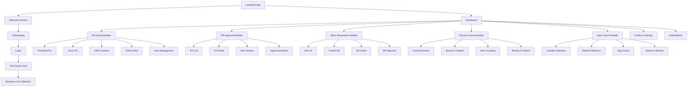
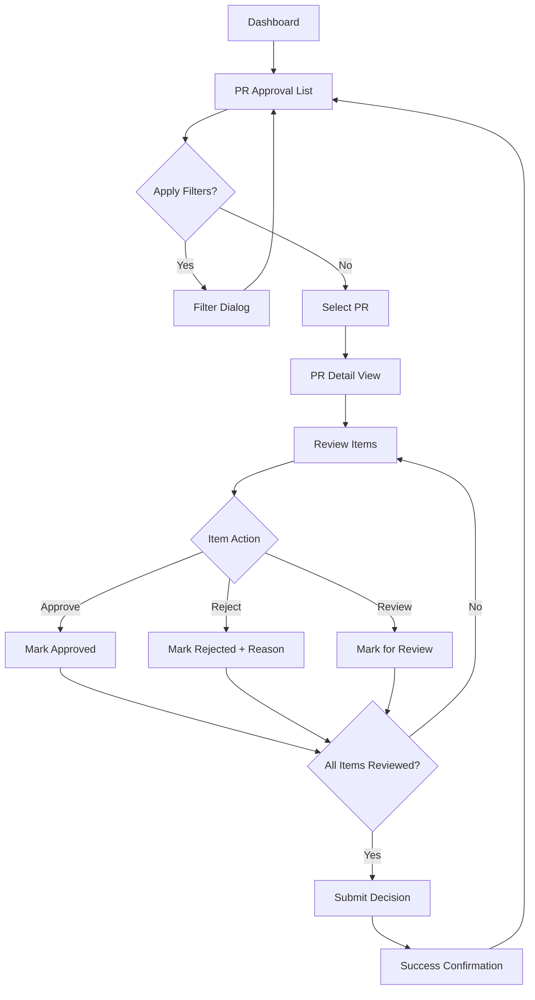
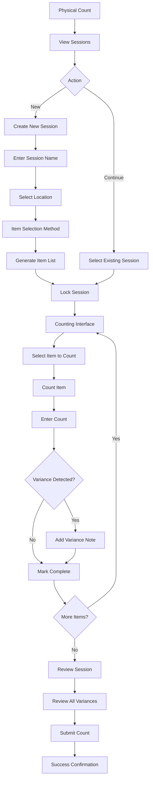
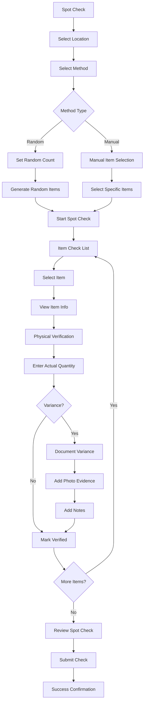

# Carmen Supply Chain Mobile App UI/UX Specification

## Introduction

This document defines the user experience goals, information architecture, user flows, and visual design specifications for Carmen Supply Chain Mobile App's user interface. It serves as the foundation for visual design and frontend development, ensuring a cohesive and user-centered experience optimized for mobile-first hospitality supply chain operations.

### Overall UX Goals & Principles

### Target User Personas

**Cost Controller (Michelle)**
- Role: Cost Controller/Finance Manager in hospitality
- Experience: 5-10 years in hospitality finance
- Tech Comfort: Moderate to high
- Context: Multi-property operations, needs mobile access for on-site audits
- Goals: Ensure inventory accuracy, maintain compliance, execute efficient spot checks
- Pain Points: Manual processes, lost paperwork, difficulty accessing data on property floors

**Receiving Clerk (David)**
- Role: Receiving/Warehouse Staff
- Experience: 2-5 years in hospitality operations
- Tech Comfort: Basic to moderate
- Context: Receiving dock, storage areas, time-pressured environment
- Goals: Efficient receiving, accurate quantity recording, proper documentation
- Pain Points: Manual calculations, missing receipts, unit conversion confusion

**PR Approver (Sarah)**
- Role: Department Head/Finance Manager
- Experience: 8+ years in hospitality management
- Tech Comfort: Moderate
- Context: Office and mobile environments, approval responsibilities
- Goals: Quick review and approval, maintain budget control, ensure compliance
- Pain Points: Email-based approvals, lack of context, delayed notifications

### Usability Goals

- **Rapid Task Completion**: Core workflows completed in under 2 minutes
- **Error Prevention**: 90% reduction in data entry errors through validation and automation
- **Mobile Efficiency**: All tasks optimized for one-handed mobile operation
- **Offline Resilience**: Critical workflows function without network connectivity
- **Learning Curve**: New users productive within 15 minutes of first use
- **Accessibility**: WCAG 2.1 AA compliance for inclusive design

### Design Principles

1. **Mobile-First Efficiency** - Optimize every interaction for mobile devices and operational contexts
2. **Progressive Disclosure** - Show only essential information, reveal details on demand
3. **Immediate Feedback** - Every action provides clear, instant visual confirmation
4. **Contextual Intelligence** - Anticipate user needs based on role, location, and workflow state
5. **Compliance by Design** - Build audit trails and policy enforcement into the user experience

### Change Log

| Date | Version | Description | Author |
| :--- | :------ | :---------- | :----- |
| June 2025 | 1.0 | Initial UI/UX specification | BMad Master |

## Information Architecture (IA)

### Site Map / Screen Inventory



### Navigation Structure

**Primary Navigation:** Fixed bottom navigation with 5 core functions
- Home (Dashboard with priority actions)
- Receiving (PO processing and GRN creation)
- Approval (PR approval workflows)
- Store Req. (Store requisition management)
- Stock Take (Inventory counting operations)

**Secondary Navigation:** Top app bar with contextual actions
- Notifications (bell icon with badge)
- Theme toggle (light/dark mode)
- Profile access (user avatar/icon)

**Breadcrumb Strategy:** Contextual page titles in app bar, with back navigation for sub-flows

## User Flows

### Purchase Requisition Approval Flow

**User Goal:** Review and approve/reject purchase requisitions efficiently while maintaining compliance

**Entry Points:** Dashboard priority actions, bottom navigation, push notifications

**Success Criteria:** PR reviewed and action taken with complete audit trail

#### Flow Diagram



**Edge Cases & Error Handling:**
- Partial approval: Clear indication of mixed item statuses
- Network failure: Save progress locally, sync when reconnected
- Permission changes: Graceful handling if approval rights revoked
- Currency conversion: Real-time exchange rate display with fallback

**Notes:** Multi-currency support with both document and base currency display throughout flow

### Receiving Workflow

**User Goal:** Process incoming deliveries efficiently with accurate quantity recording and quality control

**Entry Points:** Dashboard operations section, bottom navigation, QR code scanning

**Success Criteria:** GRN created with all items processed and inventory updated

#### Flow Diagram

```mermaid
graph TD
    Start[Dashboard/Receiving] --> Entry{Entry Method}
    Entry -->|Pending POs| POList[Pending PO List]
    Entry -->|Scan| ScanPO[Scan PO QR Code]
    Entry -->|Manual| ManualPO[Enter PO Number]
    
    POList --> SelectPO[Select PO(s)]
    ScanPO --> ValidatePO{Valid PO?}
    ManualPO --> ValidatePO
    ValidatePO -->|No| ErrorMsg[Show Error]
    ErrorMsg --> Entry
    ValidatePO -->|Yes| SelectPO
    
    SelectPO --> BUConfirm[Confirm Business Unit]
    BUConfirm --> LocationSelect[Select Receiving Location]
    LocationSelect --> CreateGRN[Create GRN]
    CreateGRN --> ItemList[Item Processing List]
    
    ItemList --> SelectItem[Select Item]
    SelectItem --> ItemDetail[Item Detail View]
    ItemDetail --> EnterQty[Enter Received Quantity]
    EnterQty --> UnitConvert{Unit Conversion?}
    UnitConvert -->|Yes| ShowConversion[Show Conversion]
    UnitConvert -->|No| QualityCheck[Quality Check]
    ShowConversion --> QualityCheck
    
    QualityCheck --> Photos{Damage/Issues?}
    Photos -->|Yes| CapturePhoto[Capture Photos]
    Photos -->|No| SaveItem[Save Item]
    CapturePhoto --> AddNotes[Add Notes]
    AddNotes --> SaveItem
    
    SaveItem --> MoreItems{More Items?}
    MoreItems -->|Yes| ItemList
    MoreItems -->|No| ReviewGRN[Review GRN]
    ReviewGRN --> SubmitGRN[Submit GRN]
    SubmitGRN --> Success[Success Confirmation]
```

**Edge Cases & Error Handling:**
- Quantity discrepancies: Clear variance indicators with override options
- Missing items: Easy addition of non-PO items
- Photo capture failure: Retry mechanism with manual note option
- Partial deliveries: Support for partial GRN creation

### Physical Count Session Flow

**User Goal:** Conduct accurate inventory counts with audit compliance and variance tracking

**Entry Points:** Dashboard operations, bottom navigation, scheduled count notifications

**Success Criteria:** Count session completed with all variances documented and submitted

#### Flow Diagram



**Edge Cases & Error Handling:**
- Session interruption: Auto-save progress with resume capability
- Large variances: Mandatory confirmation and explanation
- Item not found: Option to mark as missing with photo evidence
- Network issues: Offline counting with sync when connected

### Spot Check Quality Control Flow

**User Goal:** Perform random quality control audits for compliance and accuracy verification

**Entry Points:** Dashboard quality control section, scheduled audit notifications

**Success Criteria:** Spot check completed with all items verified and discrepancies documented

#### Flow Diagram



**Edge Cases & Error Handling:**
- Item location mismatch: Option to update location or mark as misplaced
- Significant variances: Escalation workflow with supervisor notification
- Photo capture issues: Alternative documentation methods
- Incomplete checks: Warning before submission with option to continue

## Wireframes & Mockups

**Primary Design Files:** Implemented directly in Next.js components with Tailwind CSS and Radix UI

### Key Screen Layouts

#### Dashboard (Home Screen)

**Purpose:** Provide immediate access to priority actions and operational overview

**Key Elements:**
- Priority Actions section (PR approvals, Store requisitions with count badges)
- Operations section (Receiving, Physical count with status indicators)
- Quality Control section (Spot checks with active session count)
- Quick stats and notifications summary

**Interaction Notes:** Large touch targets (minimum 44px), clear visual hierarchy, count badges for pending items

**Design File Reference:** `src/app/(mobile)/dashboard/page.tsx`

#### PR Approval List

**Purpose:** Efficient browsing and filtering of purchase requisitions requiring approval

**Key Elements:**
- Business unit selector at top
- Search bar with filter icon and active filter indicator
- Sorting dropdown (Date, Status, Business Unit)
- PR cards with currency display, status, and quick actions
- Pull-to-refresh functionality

**Interaction Notes:** Swipe gestures for quick actions, clear status indicators, multi-currency display

**Design File Reference:** `src/app/(mobile)/pr-approval/page.tsx`

#### GRN Item Detail

**Purpose:** Detailed item processing during receiving with quality control features

**Key Elements:**
- Item information header with SKU and description
- Quantity input with unit conversion display
- Quality control section with photo capture
- On-hand/on-order inventory context
- Save and continue actions

**Interaction Notes:** Large numeric input, camera integration, clear conversion ratios

**Design File Reference:** `src/app/(mobile)/receiving/grn-detail/item/[sku]/page.tsx`

#### Physical Count Interface

**Purpose:** Streamlined counting interface with variance tracking

**Key Elements:**
- Session progress indicator
- Current item details with expected quantity
- Large count input field
- Variance calculation and alert
- Photo and notes options
- Navigation between items

**Interaction Notes:** Focus on count input, clear variance indicators, easy navigation

**Design File Reference:** `src/app/(mobile)/physical-count/session/[sessionId]/count/page.tsx`

## Component Library / Design System

**Design System Approach:** Custom design system built on Radix UI primitives with Tailwind CSS, optimized for mobile-first hospitality workflows

### Core Components

#### Button

**Purpose:** Primary interaction element for user actions across all workflows

**Variants:** 
- Primary (blue background, white text)
- Secondary (transparent background, blue border)
- Destructive (red background, white text)
- Ghost (transparent background, no border)
- Outline (border only)

**States:** Default, Hover, Active, Disabled, Loading (with spinner)

**Usage Guidelines:**
- Use Primary for main CTAs (one per screen)
- Secondary for supporting actions
- Destructive only for permanent actions with confirmation
- Minimum 44px height for touch targets

#### Card

**Purpose:** Container for grouped information and actions

**Variants:**
- Default (subtle border and shadow)
- Interactive (hover states for clickable cards)
- Highlighted (for priority items or alerts)

**States:** Default, Hover, Active, Selected

**Usage Guidelines:**
- Use for list items, dashboard widgets, and form sections
- Include clear visual hierarchy within cards
- Ensure adequate padding for touch interaction

#### Input

**Purpose:** Data entry for forms and search functionality

**Variants:**
- Text input
- Number input (with mobile numeric keyboard)
- Search input (with search icon)
- Textarea (for notes and comments)

**States:** Default, Focus, Error, Disabled, Loading

**Usage Guidelines:**
- Large touch targets with adequate spacing
- Clear error states with helpful messages
- Appropriate keyboard types for mobile
- Real-time validation where appropriate

#### Badge

**Purpose:** Status indicators and count displays

**Variants:**
- Status badges (color-coded for different states)
- Count badges (for pending items)
- Currency badges (for multi-currency display)

**States:** Default, Highlighted, Muted

**Usage Guidelines:**
- Use consistent colors for status meanings
- Keep text concise and readable
- Position clearly relative to associated content

#### Dialog

**Purpose:** Modal interactions for confirmations and detailed forms

**Variants:**
- Confirmation dialogs
- Form dialogs
- Information dialogs
- Full-screen modals (for complex forms)

**States:** Open, Closed, Loading

**Usage Guidelines:**
- Use sparingly to avoid interrupting workflow
- Provide clear close actions
- Ensure mobile-friendly sizing and scrolling

## Branding & Style Guide

### Visual Identity

**Brand Guidelines:** Carmen Software brand identity with hospitality industry focus

### Color Palette

| Color Type    | Hex Code | Usage                                    |
| :------------ | :------- | :--------------------------------------- |
| **Primary**   | #0F52BA  | Primary actions, branding, active states |
| **Secondary** | #6B7280  | Secondary actions, muted text            |
| **Accent**    | #3B82F6  | Links, information highlights            |
| **Success**   | #10B981  | Positive feedback, confirmations         |
| **Warning**   | #F59E0B  | Cautions, important notices              |
| **Error**     | #EF4444  | Errors, destructive actions              |
| **Neutral**   | #F9FAFB to #111827 | Text, borders, backgrounds (adaptive) |

### Typography

**Font Families:**
- **Primary:** Geist Sans (modern, readable, optimized for screens)
- **Secondary:** Geist Sans (consistent family usage)
- **Monospace:** Geist Mono (for SKUs, codes, and technical data)

**Type Scale:**
| Element | Size | Weight | Line Height |
|:--------|:-----|:-------|:------------|
| H1 | 24px | 700 | 1.2 |
| H2 | 20px | 600 | 1.3 |
| H3 | 18px | 600 | 1.4 |
| Body | 16px | 400 | 1.5 |
| Small | 14px | 400 | 1.4 |
| Caption | 12px | 400 | 1.3 |

### Iconography

**Icon Library:** Lucide React - consistent, modern icon set

**Usage Guidelines:** 
- 16px for inline icons
- 20px for button icons
- 24px for navigation icons
- Consistent stroke width and style
- Semantic meaning over decorative use

### Spacing & Layout

**Grid System:** CSS Grid with mobile-first responsive breakpoints

**Spacing Scale:** 
- 4px base unit
- 8px, 12px, 16px, 20px, 24px, 32px, 48px, 64px
- Consistent application across components

## Accessibility Requirements

### Compliance Target

**Standard:** WCAG 2.1 AA compliance with mobile accessibility best practices

### Key Requirements

**Visual:**
- Color contrast ratios: 4.5:1 for normal text, 3:1 for large text
- Focus indicators: 2px blue outline with adequate contrast
- Text sizing: Minimum 16px for body text, scalable to 200%

**Interaction:**
- Keyboard navigation: Full functionality without mouse/touch
- Screen reader support: Semantic HTML with ARIA labels
- Touch targets: Minimum 44px × 44px with 8px spacing

**Content:**
- Alternative text: Descriptive alt text for all images and icons
- Heading structure: Logical hierarchy with proper heading levels
- Form labels: Clear, descriptive labels for all form inputs

### Testing Strategy

- Automated testing with axe-core
- Manual testing with screen readers (VoiceOver, TalkBack)
- Keyboard navigation testing
- Color contrast validation
- Mobile accessibility testing on actual devices

## Responsiveness Strategy

### Breakpoints

| Breakpoint | Min Width | Max Width | Target Devices           |
| :--------- | :-------- | :-------- | :----------------------- |
| Mobile     | 320px     | 767px     | Phones, small tablets    |
| Tablet     | 768px     | 1023px    | Tablets, small laptops   |
| Desktop    | 1024px    | 1439px    | Laptops, desktop screens |
| Wide       | 1440px    | -         | Large desktop screens    |

### Adaptation Patterns

**Layout Changes:** 
- Mobile: Single column, stacked navigation
- Tablet: Two-column where appropriate, side navigation option
- Desktop: Multi-column layouts, expanded navigation

**Navigation Changes:**
- Mobile: Bottom navigation, hamburger menu for secondary
- Tablet: Side navigation option, expanded bottom bar
- Desktop: Top navigation bar, sidebar navigation

**Content Priority:**
- Progressive disclosure based on screen real estate
- Essential actions always visible
- Secondary information revealed on demand

**Interaction Changes:**
- Mobile: Touch-optimized, swipe gestures
- Desktop: Hover states, keyboard shortcuts
- Adaptive input methods based on device capabilities

## Animation & Micro-interactions

### Motion Principles

- **Purposeful:** Every animation serves a functional purpose
- **Responsive:** Fast enough to feel immediate (< 300ms)
- **Respectful:** Honor user's motion preferences
- **Consistent:** Unified easing and timing across the app

### Key Animations

- **Page Transitions:** Slide transitions between screens (250ms, ease-out)
- **Button Press:** Scale and color feedback (150ms, ease-out)
- **Loading States:** Skeleton loading and spinners (continuous, ease-in-out)
- **Form Validation:** Error state transitions (200ms, ease-out)
- **Modal Appearance:** Fade and scale entrance (300ms, ease-out)
- **List Updates:** Smooth item additions/removals (250ms, ease-in-out)

## Performance Considerations

### Performance Goals

- **Page Load:** < 2 seconds on 3G networks
- **Interaction Response:** < 100ms for immediate feedback
- **Animation FPS:** 60fps for smooth motion

### Design Strategies

- Optimize images and use Next.js Image component
- Implement lazy loading for non-critical content
- Use CSS transforms for animations (hardware acceleration)
- Minimize bundle size with code splitting
- Progressive enhancement for offline functionality

## Next Steps

### Immediate Actions

1. **Stakeholder Review:** Present specification to product and development teams
2. **Design System Implementation:** Finalize component library in Storybook
3. **Prototype Testing:** Conduct usability testing with target users
4. **Technical Architecture:** Coordinate with frontend architecture specification

### Design Handoff Checklist

- [x] All user flows documented
- [x] Component inventory complete
- [x] Accessibility requirements defined
- [x] Responsive strategy clear
- [x] Brand guidelines incorporated
- [x] Performance goals established
- [x] Mobile-first approach confirmed
- [x] Multi-currency support specified
- [x] Workflow compliance requirements documented

## Checklist Results

✅ **User Experience Goals:** Clearly defined with measurable targets
✅ **Information Architecture:** Complete site map and navigation structure
✅ **User Flows:** All critical workflows documented with edge cases
✅ **Component System:** Comprehensive component library specification
✅ **Accessibility:** WCAG 2.1 AA compliance requirements defined
✅ **Mobile Optimization:** Mobile-first approach with touch optimization
✅ **Performance:** Clear performance goals and optimization strategies
✅ **Brand Consistency:** Aligned with Carmen Software brand identity

This UI/UX specification provides comprehensive guidance for implementing a mobile-first, accessible, and efficient user experience for the Carmen Supply Chain Mobile App, specifically tailored for hospitality industry workflows and multi-property operations.